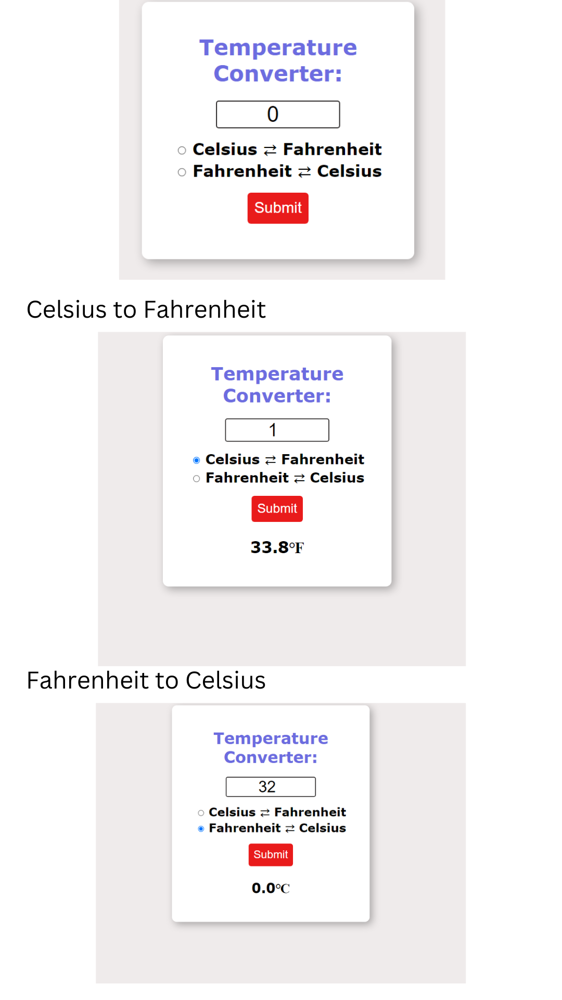

# Temperature converter ℃ ⇄ ℉



#  Javascript code
```
const textbox=document.getElementById(`textbox`);
toFahrenheit=document.getElementById(`toFahrenheit`)
tocelsius=document.getElementById(`tocelsius`)
result=document.getElementById(`result`);
let temp;
function convert(){
if(toFahrenheit.checked){
   temp=Number(textbox.value)
   temp=temp * 9/5 + 32;
   result.textContent=temp.toFixed(1)+"℉"
}
else if(tocelsius.checked){
    temp=Number(textbox.value)
    temp=(temp-32) *5/9;
    result.textContent=temp.toFixed(1)+"℃"
 }
else{
    result.textContent= `Select a unit`;
}

}
```

# FORMULA
```
Fahrenheit 
temp=temp * 9/5 + 32;

Celsius
 temp=(temp-32) *5/9;

 ```

